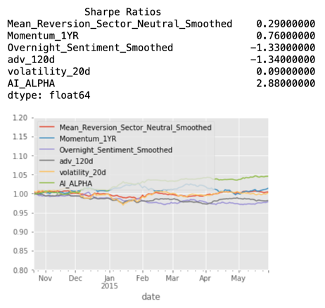

# us-equities-portfolio-demos

## Description
This project showcases a machine learning-based portfolio optimisation strategy specifically designed for US equities. By seamlessly integrating risk and alpha factors while accounting for linear transaction costs, it aims to achieve superior performance. At the heart of this strategy is a Random Forest-based non-overlapping estimator, which significantly enhances medium-frequency trading by effectively amalgamating diverse alpha factors. For a comprehensive evaluation of these factors, Alphalens is employed to rigorously assess their performance. The strategy is further validated through extensive backtesting, ensuring robustness and reliability.
## Table of Contents
- [Features](#features)
- [Installation](#installation)
- [Usage](#usage)
- [Licence](#licence)
- [Acknowledgements](#acknowledgements)
## Features
- **Risk Factor Construction:**
We calculate risk factors to predict portfolio risk using the formula

  $$\sqrt{h^T(BFB^T+S)h}$$,
  where:
  - $h$ is the portfolio weights (holdings),
  - $B$ is the factor betas,
  - $F$ is the factor covariance matrix, and
  - $S$ is the idiosyncratic variance matrix.

- **Optimised Estimator for 5-Day-Ahead Performance:**
  This repo includes an estimator optimised for 5-day-ahead equity performance. The challenge of overlapping labels, which violates the i.i.d assumption and can cause overfitting, is handled by the `NoOverlapVoter`. This module trains individual estimators on non-overlapping data subsets and then aggregates their predictions using a voting mechanism. More details on this approach can be found in [Advances in Financial Machine Learning](https://www.wiley.com/en-br/Advances+in+Financial+Machine+Learning-p-9781119482086) by Marcos Lopez de Prado.

- **Alpha Factor Performance:**
  Our AI ALPHA model consistently generates positive results during validation, even when performance across individual factors varies significantly. The effectiveness of combining alphas is shown in the following visualisation:

  

- **Transaction Costs:**
Transaction cost (or slippage) is calculated by multiplying the price change caused by market impact by the dollar amount traded:

  $$tcost_{i,t} = \sum_{i}^{N} \lambda_{i,t} (h_{i,t} - h_{i,t-1})^2$$,
  where
  $$\lambda_{i,t} = \frac{1}{10 \times \text{ADV}_{i,t}}$$ with $ADV_i$ = Average Daily Volume for asset $i$.

- **Convex Optimization for Portfolio Construction:**
  We leverage a custom `cvxpy`-based convex optimization class to build a balanced equity portfolio. This approach integrates alpha factors, risk factors, and transaction costs. Let us define the terms:
    - factor risk ($\mathbf{Q}^T \mathbf{Q} = \mathbf{BFB}^T$),
    - idiosyncratic risk ($\mathbf{S}$),
    - combined portfolio alpha ($\mathbf{\alpha}$), and
    - transaction costs ($\mathbf{\Lambda}$).
  Then the optimization objective function is:
  
```math
f(\mathbf{h}) = \frac{1}{2} \kappa \mathbf{h}_t^T \mathbf{Q}^T \mathbf{Q} \mathbf{h}_t + \frac{1}{2} \kappa \mathbf{h}_t^T \mathbf{S} \mathbf{h}_t - \mathbf{\alpha}^T \mathbf{h}_t + (\mathbf{h}_t - \mathbf{h}_{t-1})^T \mathbf{\Lambda} (\mathbf{h}_t - \mathbf{h}_{t-1}).
```

- **Backtesting and Performance Analysis:**
  We use Zipline for thorough backtesting, which evaluates historical portfolio performance. Additionally, PyFolio is utilised for performance analysis, providing detailed insights into the risk and return profiles of the strategy, assisting in informed decision-making.

## Installation

This project relies on several libraries, including Zipline, Alphalens, and PyFolio, which have C-based dependencies. To simplify the installation process and avoid potential issues, we currently support installation via Conda only.

### Step 1: Install Conda

If you don't have Conda installed, you can download and install it from the [Anaconda website](https://www.anaconda.com/) or use the lightweight [Miniconda installer](https://docs.conda.io/en/latest/miniconda.html). Follow the installation instructions provided on the website to set it up on your Mac.

### Step 2: Set Up the Environment

Once Conda is installed, you can create a new environment using the `environment.yml` file provided in the repository. This file contains all the necessary dependencies for the project.

1. Open your terminal.
2. Navigate to the directory containing the `environment.yml` file.
3. Run the following command to create and activate the environment:

    ```bash
    conda env create -f environment.yml
    conda activate pconst310
    ```

### Step 3: Ingest Quandl Data

Zipline requires Quandl data for backtesting. To ingest this data, you'll need a Quandl API key. Follow these steps to obtain and configure your API key:

#### Get a Quandl API Key:

1. Visit the [NASDAQ Data Link website](https://data.nasdaq.com/) and sign up for an account.
2. Once registered, navigate to your account settings to find your API key.

#### Configure the API Key:

1. Open your terminal.
2. Use a text editor to open your `.bash_profile` or `.bashrc` file. For example, you can use `nano`:

    ```bash
    nano ~/.bash_profile
    ```

3. Add the following line to the file, replacing `<your_key>` with your actual Quandl API key:

    ```bash
    export QUANDL_API_KEY=<your_key>
    ```

4. Save the file and exit the editor.
5. Run the following command to apply the changes:

    ```bash
    source ~/.bash_profile
    ```

#### Ingest the Data:

Run the following command in your terminal to ingest the Quandl data:

```bash
zipline ingest -b quandl
```

## Usage
To run the portfolio optimisation strategy, execute the `orchestrator.py` script located under the `src/alphalab` directory. This script orchestrates the entire process of data ingestion, model training, and portfolio rebalancing.

1. Open your terminal.
2. Navigate to the `src/alphalab` directory in your project.
3. Run the following command:

   ```bash
   python orchestrator.py
   ```

This will initiate the process, utilising the integrated strategies and tools to optimise the portfolio based on the predefined parameters and data.

## License
This project is licensed under the MIT Licence.
## Acknowledgements

In making this repo, I have heavily borrowed from:
- various projects in Udacity's [AI for Trading course](https://www.udacity.com/enrollment/nd880), and
- [Advances in Financial Machine Learning](https://www.wiley.com/en-br/Advances+in+Financial+Machine+Learning-p-9781119482086) by Marcos Lopez de Prado.
