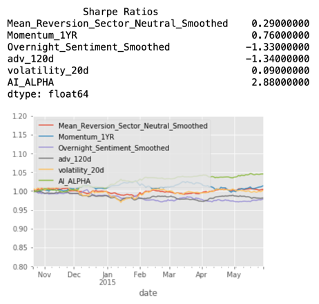

# us-equities-portfolio-demos

## Description
This project presents an advanced portfolio optimisation strategy tailored for US equities. It integrates risk and alpha factors while accounting for linear transaction costs to achieve optimal performance. Central to this strategy is a Random Forest-based non-overlapping estimator, designed to enhance medium-frequency trading by effectively combining alpha factors. For a robust analysis of these factors, Alphalens is utilised to thoroughly evaluate their performance. Comprehensive backtesti...

## Table of Contents
- [Installation](#installation)
- [Usage](#usage)
- [Features](#features)
- [Licence](#licence)
- [Acknowledgements](#acknowledgements)

## Installation

This project relies on several libraries, including Zipline, Alphalens, and PyFolio, which have C-based dependencies. To simplify the installation process and avoid potential issues, we currently support installation via Conda only.

## Step 1: Install Conda

If you don't have Conda installed, you can download and install it from the [Anaconda website](https://www.anaconda.com/) or use the lightweight [Miniconda installer](https://docs.conda.io/en/latest/miniconda.html). Follow the installation instructions provided on the website to set it up on your Mac.

## Step 2: Set Up the Environment

Once Conda is installed, you can create a new environment using the `environment.yml` file provided in the repository. This file contains all the necessary dependencies for the project.

1. Open your terminal.
2. Navigate to the directory containing the `environment.yml` file.
3. Run the following command to create and activate the environment:

    ```bash
    conda env create -f environment.yml
    conda activate pconst310
    ```

## Step 3: Ingest Quandl Data

Zipline requires Quandl data for backtesting. To ingest this data, you'll need a Quandl API key. Follow these steps to obtain and configure your API key:

### Get a Quandl API Key:

1. Visit the [NASDAQ Data Link website](https://data.nasdaq.com/) and sign up for an account.
2. Once registered, navigate to your account settings to find your API key.

### Configure the API Key:

1. Open your terminal.
2. Use a text editor to open your `.bash_profile` or `.bashrc` file. For example, you can use `nano`:

    ```bash
    nano ~/.bash_profile
    ```

3. Add the following line to the file, replacing `<your_key>` with your actual Quandl API key:

    ```bash
    export QUANDL_API_KEY=<your_key>
    ```

4. Save the file and exit the editor.
5. Run the following command to apply the changes:

    ```bash
    source ~/.bash_profile
    ```

### Ingest the Data:

Run the following command in your terminal to ingest the Quandl data:

```bash
zipline ingest -b quandl
```

## Usage
To run the portfolio optimisation strategy, execute the `orchestrator.py` script located under the `src/alphalab` directory. This script orchestrates the entire process of data ingestion, model training, and portfolio rebalancing.

1. Open your terminal.
2. Navigate to the `src/alphalab` directory in your project.
3. Run the following command:

   ```bash
   python orchestrator.py
   ```
   
This will initiate the process, utilising the integrated strategies and tools to optimise the portfolio based on the predefined parameters and data.

## Features

- **Optimised Estimator for 5-Day-Ahead Performance:**  
  Our estimator is designed to optimise for 5-day-ahead equity performance. The challenge of overlapping labels, which can disrupt the independent and identically distributed (i.i.d) assumption and lead to overfitting, is addressed using the `NoOverlapVoter`. This tool trains separate estimators on non-overlapping data sets and combines them through a voting mechanism. For further insights, refer to [Advances in Financial Machine Learning](https://www.wiley.com/en-br/Advances+in+Financial+Machine+Learning-p-9781119482086) by Marcos Lopez de Prado.

- **Alpha Factor Performance:**  
  Despite notable differences in factor performances across three sets, our AI ALPHA consistently achieves positive results during the validation phase. The accompanying visualisation illustrates the effectiveness of combining alphas.

  

- **Convex Optimisation for Portfolio Construction:**  
  Utilising a custom `cvxpy`-based convex optimisation class, we integrate combined alpha factors, risk factors, and transaction costs to construct a balanced portfolio of equities. This ensures that all critical variables are considered for optimal portfolio design.

- **Backtesting and Performance Analysis:**  
  We use Zipline for rigorous backtesting of the portfolio, evaluating its historical performance. PyFolio provides detailed performance analysis, offering insights into the strategy's risk and return characteristics, which support informed decision-making.

## TODO
Things to add as the next steps.

## Licence
This project is licensed under the MIT Licence.
## Acknowledgements

In making this repo, I have heavily borrowed from: 
- various projects in Udacity's [AI for Trading course](https://www.udacity.com/enrollment/nd880), and
- [Advances in Financial Machine Learning](https://www.wiley.com/en-br/Advances+in+Financial+Machine+Learning-p-9781119482086) by Marcos Lopez de Prado.